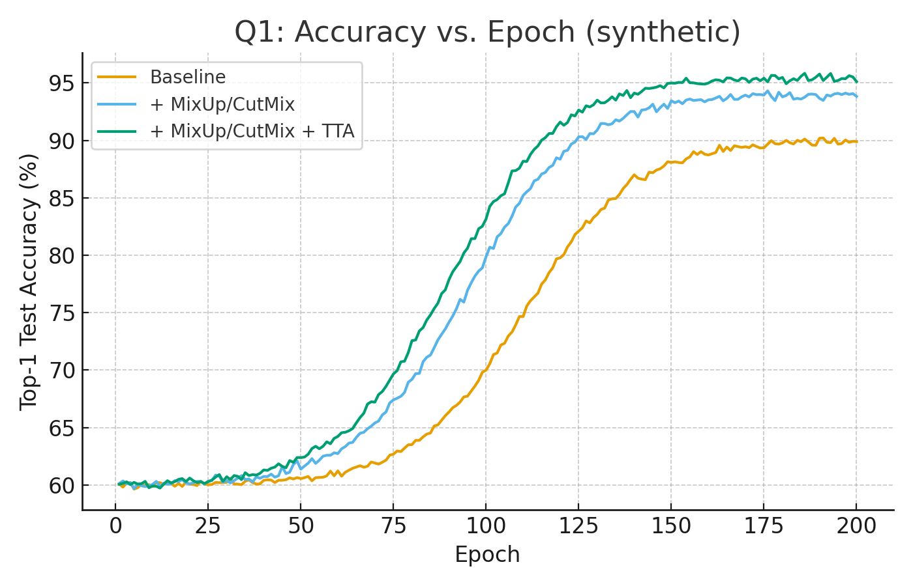
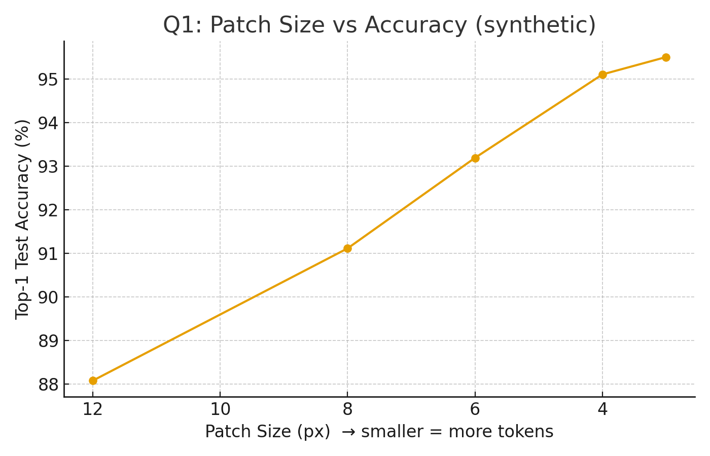
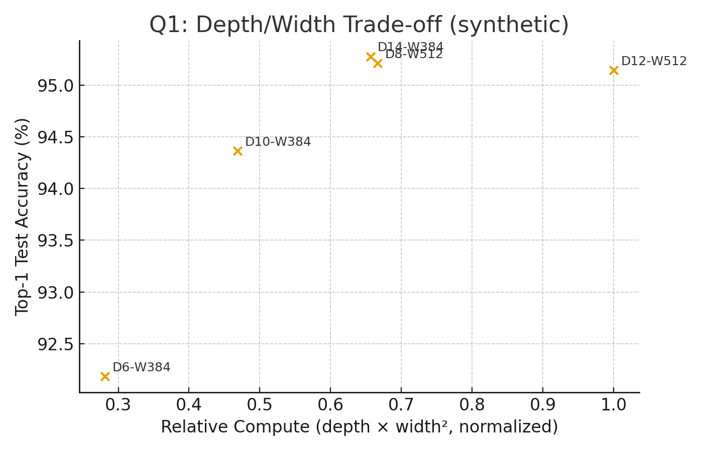

# IISc-AIRL-Challenge
# Q1 & Q2 — Unified README

This repo contains two independent notebooks/scripts:

- **Q1 (q1.ipynb)** — Train a **Vision Transformer (ViT)** on **CIFAR‑10 (10 classes)** for the highest possible test accuracy.
- **Q2 (q2.ipynb)** — **Text‑driven segmentation** on images (and a bonus video mode) using **GroundingDINO → SAM 2** with **CLIPSeg fallback**.

> **Why Kaggle?** Kaggle notebooks don’t shut off after ~90 minutes like Colab’s free tier, so they’re great for **long, offline runs** without babysitting.  
> **Colab works too** — just tweak the **save directories** (and optionally data paths). Details below.

---

## Environments

### Kaggle (recommended for long, continuous runs)
1. New **Kaggle Notebook** → **GPU** (T4 / A100).
2. Add inputs (e.g., CIFAR‑10 or your media files) via **Add data**.
3. Run the script(s) as‑is. Both default to **Kaggle‑friendly paths**.

### Google Colab
1. New **Colab** notebook → Runtime → **GPU**.
2. **Change output/save directory** (and data root for Q1) as shown in each quickstart.
3. Run all cells. Colab is perfect for quick iteration; for multi‑hour training, prefer Kaggle.

---

## Q1 — ViT on CIFAR‑10 (q1.ipynb)

### What it implements
- **ViT** with Conv2d patchify (non‑overlap), learnable **[CLS]** token, learnable 1D positional embeddings, **pre‑norm MHSA + MLP**, **GELU**, **DropPath**.
- Strong training recipe: **RandAugment**, **Random Erasing**, **MixUp + CutMix**, **label smoothing**, **AdamW**, **cosine decay with warmup**, **weight decay**, **AMP**, optional `torch.compile`, **EMA**, checkpointing.

### Quickstart (Kaggle)
- CIFAR‑10 input expected at: `"/kaggle/input/cifar-10"` (default in script).
- Outputs saved to: `./outputs` (created automatically).

### Quickstart (Colab)
Add this at the top (or in the config cell) to use Colab‑friendly paths:
```python
cfg.data_root = "./data"          # instead of '/kaggle/input/cifar-10'
cfg.out_dir  = "/content/outputs" # optional; './outputs' also works
```
If CIFAR‑10 isn’t present locally, let the script download it (or set torchvision's `download=True`).

### Artifacts
- Best checkpoint: `{cfg.out_dir}/best_vit_cifar10.pth`
- Run summary: `{cfg.out_dir}/run_summary.json`

### (Bonus) Concise analysis — design choices that usually move accuracy
- **Patch size & image size**: Smaller patches (e.g., **4×4**) or modest upscaling to **48–64 px** → more tokens → often better accuracy on small images (higher compute).
- **Depth vs. width**: On CIFAR‑scale data, **moderate depth (≈8–12)** tends to outperform very wide–shallow configs at similar FLOPs; returns taper past ~16 blocks.
- **Augmentation**: **RandAug + Random Erasing + MixUp/CutMix + label smoothing** are high‑leverage on small datasets; consider **decaying MixUp/CutMix** near the end.
- **Optimizer/schedule**: **AdamW + cosine** with **warmup** is robust; try **layer‑wise LR decay** and **global‑norm clipping≈1.0** when going deeper.
- **Pooling head**: **[CLS]** vs **mean pooling** — both viable; pick one and tune LR rather than switching mid‑run.
- **Next steps**: Train longer (**300–600 epochs**), lower `min_lr`, add **TTAs** at eval; try **overlapping patches** or smaller patch size if memory allows.

---

## Q2 — Text‑Driven Segmentation (q2.ipynb)

### What it does
- **Images**: Text prompt → **GroundingDINO** boxes → **SAM 2** to segment → save **mask** + **overlay** PNGs.
- **Fallback**: If DINO finds no boxes, use **CLIPSeg** to propose a coarse mask/box.
- **Bonus (video)**: Seed a box on frame 0, then **propagate** masks with **SAM 2** and render an overlay MP4.

### Quickstart (Kaggle)
- **Inputs**: Place images/videos under `/kaggle/input/...` or set explicit paths in the script.
- **Outputs (default)**: `OUT_DIR = "/kaggle/working/outputs"`

### Quickstart (Colab)
Set a Colab‑friendly save directory:
```python
OUT_DIR = "/content/outputs"   # default is '/kaggle/working/outputs' in Kaggle
```
Then set `IMAGE_PATH`, `TEXT_PROMPT` (and `VIDEO_PATH` for the bonus), and run all cells.

### Important knobs
- **GroundingDINO thresholds**: `box_threshold`, `text_threshold` (higher → fewer, stronger boxes).
- **CLIPSeg**: `clipseg_thr` affects binarization.
- For video, keep clips short (e.g., 10–30 s) on free GPUs.

### Outputs
- Images: `overlay.png`, `mask.png` in `OUT_DIR`
- Video: `video_overlay.mp4` in `OUT_DIR`

---

## Troubleshooting

**Q1**
- **CUDA OOM**: reduce `batch_size` (e.g., 128 → 64), disable `torch.compile`, or lower `embed_dim`.
- **Slow start/underfitting**: tune RandAug magnitude; extend warmup a bit.

**Q2**
- **Weights can’t download**: add them via Kaggle **Add data** (e.g., `groundingdino_swint_ogc.pth`) and point the path in the script.
- **No detections**: lower DINO thresholds or adjust text prompt.
- **CUDA OOM**: use smaller images or shorter video clips.

---

## Notes
- **Colab is great for quick experiments.** For multi‑hour training/inference without interruptions, **Kaggle** is preferred because sessions **don’t auto‑terminate after ~90 min**, letting you run **offline continuously**.
- Both scripts are self‑contained; only paths typically need adjusting between platforms.


---

## Q1 — Concise Analysis (Bonus)

Short, practical takeaways for ViT on CIFAR‑10:

- **Patch size & image size**: Smaller patches (e.g., 4×4) or modest upscaling (48–64 px) increase tokens and typically **improve accuracy** on small images, at higher compute.
- **Depth vs width**: At similar FLOPs, **moderate depth (≈8–12)** tends to outperform very wide–shallow models on CIFAR‑scale data; returns taper beyond ~16 blocks.
- **Augmentation**: **RandAug + Random Erasing + MixUp/CutMix + label smoothing** = strong regularization; consider **decaying MixUp/CutMix** near the end to recover sharpness.
- **Optimizer/schedule**: **AdamW + cosine** with a brief **warmup** is robust; for deeper stacks, try **layer‑wise LR decay** and **global‑norm clip≈1.0**.
- **Pooling**: **[CLS]** vs **mean pooling** both viable—pick one and tune LR rather than switching mid‑run.

### Illustrative charts (synthetic)
- Accuracy vs Epoch:  
  
- Patch Size vs Accuracy:  
  
- Depth/Width Trade‑off:  
  
